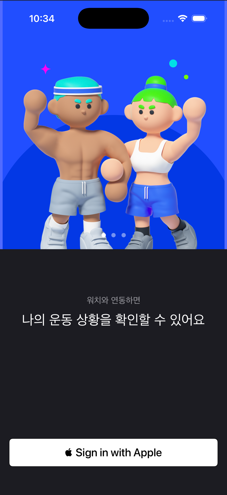

# Pumping iOS

운동 선택과 기록, HealthKit, Apple Watch 연동을 포함하는 **Pumping** iOS/watchOS 프로젝트 복원본입니다. 원래 SwiftUI/TCA 화면과 Micro Feature Architecture를 유지하면서 최신 Tuist와 Xcode에서 project graph가 다시 생성·빌드되도록 manifest/API 호환성만 마이그레이션했습니다.

> 과거 팀 프로젝트의 개인 팀원 정보는 문서에서 제거했습니다. 앱 이름, 운동 선택 UX, HealthKit/watchOS 구조는 원형을 유지했습니다.

## Restored preview



위 이미지는 iPhone 17 Pro Simulator에 복원본을 실제 설치·실행한 뒤 캡처했습니다.

## Architecture

Tuist 기반 Micro Feature Architecture:

```text
Projects/
├── App
├── Feature
├── Domain
├── Core
├── Shared
└── WatchShared
```

Feature/Domain/Core는 interface와 implementation 경계를 나누고, iOS 앱과 watchOS extension이 공유 계층을 통해 연결됩니다.

## Stack

- Swift / SwiftUI
- The Composable Architecture 0.59
- HealthKit
- WatchConnectivity
- Tuist 4.205
- iOS + watchOS

## Generate & build

```bash
tuist install
tuist generate --no-open

xcodebuild \
  -workspace Pumping.xcworkspace \
  -scheme Pumping \
  -configuration Debug \
  -destination 'platform=iOS Simulator,name=iPhone 17 Pro' \
  CODE_SIGNING_ALLOWED=NO \
  build
```

현재 iOS 26.5 + watchOS 26.5 simulator graph까지 포함해 `BUILD SUCCEEDED`를 확인했습니다.

## Modernization scope

- Tuist 3-era manifest API → Tuist 4 API migration
- Swift Package dependency resolution 복원
- 현재 TCA 버전의 `SwitchStore` / `CaseLet` API에 맞춘 최소 호환 수정
- 원래 Workout 화면과 Store 구조 유지

Recovery dashboard나 새로운 개인 건강 로직은 추가하지 않았습니다.
